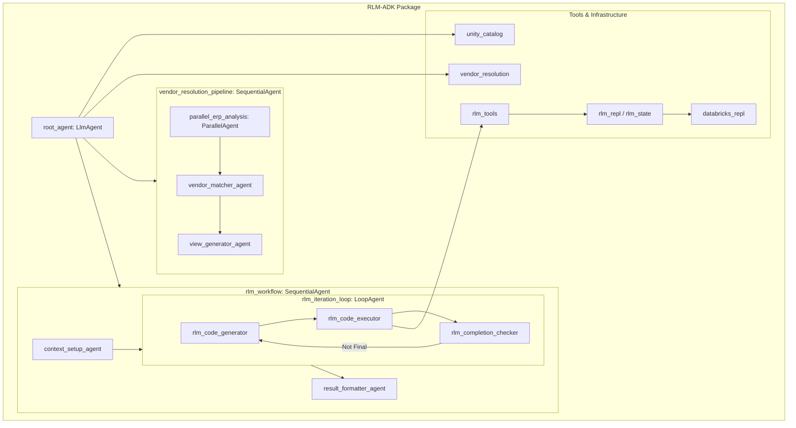

# RLM-ADK Architectural Overview

The `rlm_adk` package is an agentic framework built on `google-adk` that implements the Recursive Language Model (RLM) paradigm. It is specifically designed for healthcare data science tasks, such as vendor resolution across Databricks Unity Catalog volumes.

## High-Level Architecture

The architecture is hierarchical and modular, centered around a Root Agent that coordinates between standard business pipelines and recursive RLM workflows.

### Core Components

1. **Root Agent (`root_agent`)**: Acts as the primary coordinator, providing access to both standard pipelines and the RLM recursive workflow.
2. **Vendor Resolution Pipeline**: A `SequentialAgent` that orchestrates:
    - **Parallel ERP Analysis**: Uses a `ParallelAgent` to concurrently analyze data from multiple sources (e.g., Alpha, Beta, Gamma hospital chains).
    - **Vendor Matching**: Resolves vendor instances to master data.
    - **View Generation**: Creates unified analytical views in Databricks.
3. **RLM Workflow**: A specialized `SequentialAgent` implementing the RLM paradigm:
    - **Context Setup**: Prepares the data environment.
    - **RLM Iteration Loop**: A `LoopAgent` that repeatedly:
        - Generates Python code (utilizing `llm_query` for recursion).
        - Executes code in a persistent REPL.
        - Checks for a 'FINAL' answer.
    - **Result Formatter**: Finalizes the output for the user.

### Internal Dependencies & Infrastructure

- **ADK Integration**: Heavily relies on `google.adk` for agent orchestration and tool management.
- **State Management**: Uses `rlm_state.py` and `rlm_repl.py` to maintain session state and REPL persistence across iterations.
- **LLM Bridge**: `llm_bridge.py` provides `llm_query` and `llm_query_batched` functions to the REPL environment, enabling recursive LLM calls from within executed code.

## Mermaid Flowchart

